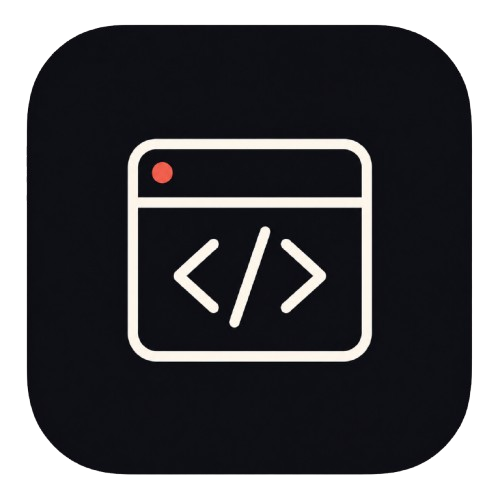

> 很感谢老师们在我每次对接时的及时回应、以及可爱的同学们在每个阶段任务中的积极配合
>
> 仓库地址：https://github.com/ceilf6/code-tape

# 一、管理者身份

在学习了“项目管理”课程中的“学习型组织”概念后，结合我对 Harness 开发范式的理解，我毛遂自荐想担任组长一职，也很荣幸能被大家选上

下面我从**人力分配**以及**仓库管理**两个维度介绍我作为管理者的工作


## 1、宏观规划

首先我作为组长，不仅要做好老师们、同学们的沟通工作，同时要时时刻刻对项目的进展进行宏观把握


### 1.1、人员调度

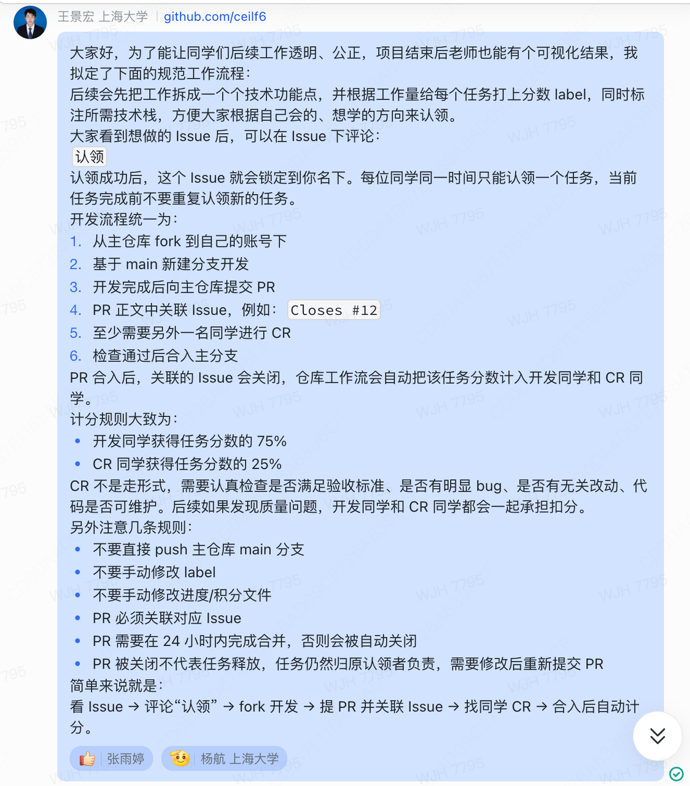

考虑到咱们项目场景是异地多人协同开发，我直接选择利用 Github 作为协作基建，节省前期基建的时间

在开发模式上我采用 Google Chunk 小粒度主干协作：首先我会将 PRD 作为宏任务进行拆解，每个阶段又可以划分很多微任务，按照拓扑排序确保每个 issue 的前序工作都已经完成，每位同学认领任务后，从 `main` 拉出短生命周期分支或 fork 分支开发，通过小 PR、CR、质量闸门、维护者确认和 squash merge 回到 `main`。仓库不采用 Git Flow、GitHub Flow 或 GitLab Flow 作为主流程，详细原因可以查看决策记录贴 [discussions/70](https://github.com/ceilf6/code-tape/discussions/70)

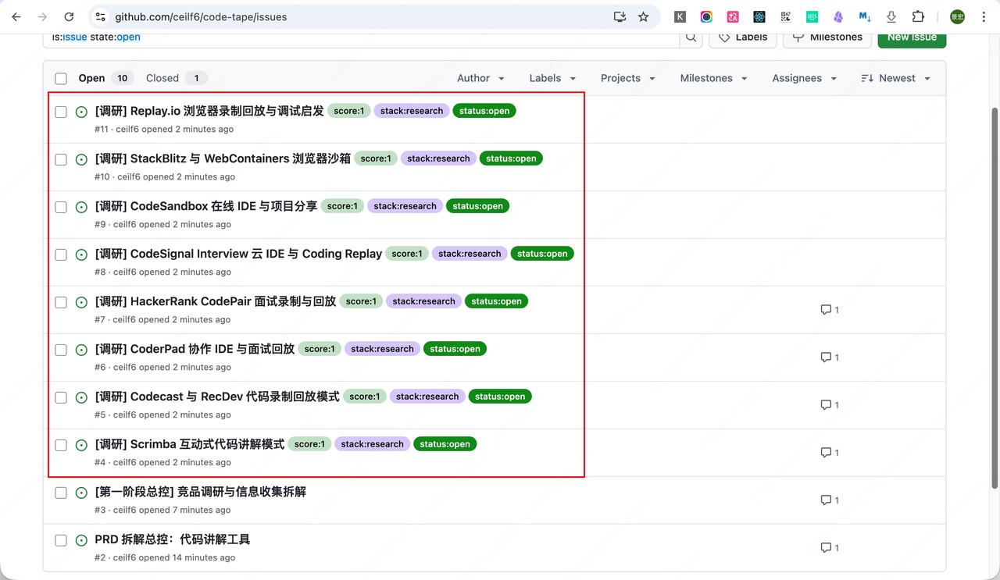

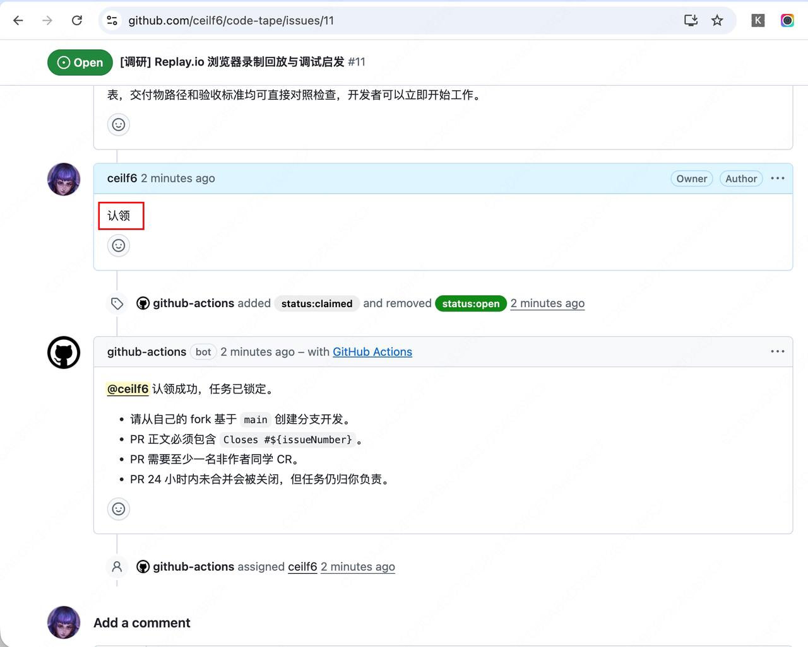

接着每个同学在认领到任务后在他们自己的 fork 仓库进行开发，并在开发后往主仓库发起 PR ，非 PR 作者的 CR 人员在 CR 以及下面 2.1 会介绍的 ceilf6/repo-guard CR通过后才能合入。过程中为了同大家明确 CR 标准，沉淀了文档 [ Code Review 说明](https://my.feishu.cn/wiki/SKZWwAB8Zi9g4Ukv4BicyEl7nKc)

考虑到如何提高同学们的积极性，我会根据任务的工作量给 issue 打上 score label 分数标签，并利用 CICD 工作流 [workflows](https://github.com/ceilf6/code-tape/tree/main/scripts/workflows) 进行维护管理，具体可以查看仓库中的 [progress.md](https://github.com/ceilf6/code-tape/blob/main/docs/progress.md) 和 [progress.json](https://github.com/ceilf6/code-tape/blob/main/docs/progress.json) 文件；同时我也会为每个 issue 打上 stack **技术栈标签**，确保能够兼顾到每位同学他们擅长的以及他们想做的，否则如果有同学认领到了他不想做的任务会导致交付质量和同学积极性都很低

以上所有工作流程我都已经沉淀在文档[ 规范工作流流程](https://my.feishu.cn/wiki/HIsfwy5t8i0xxjknmB9cVkINndc)方便大家随时查阅


### 1.2、敏捷开发

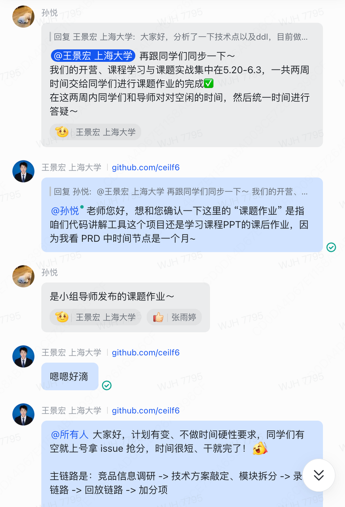

在同老师们确认了项目时间周期只有 2 周后，我决策进行**敏捷开发**，即分阶段批次发派任务，并在每个阶段结束后立即发包、及时同 PM 等各位老师进行确认产品是否偏离，从而明确项目走向是否正确

接着我进行了技术模块的分析，构写了[ 技术模块拆解](https://my.feishu.cn/wiki/OAD9wvfKPidOBBkuSlHculCWnKb)，并根据模块拆解文档进行了初步的时间规划，撰写了[ 时间规划](https://my.feishu.cn/wiki/AsYNwDyFciCw3ckfbkTcPvPuntb)（这些文档都沉淀到了项目的 docs/ 目录下，方便需要时给予 Agent 完整上下文）

最终明确了一条主链路：竞品信息调研 -> 技术方案敲定、模块拆分 -> 录制链路 -> 回放链路 -> 加分项


在我看来，软件工程敏捷开发的本质就是从实现 MVP 后不断进行矫正、完善成为一个真正的产品，这一点可以从咱们的发包进程看出：https://github.com/ceilf6/code-tape/releases

1. 5.27 发布了 P0 MVP 包 https://github.com/ceilf6/code-tape/releases/tag/P0

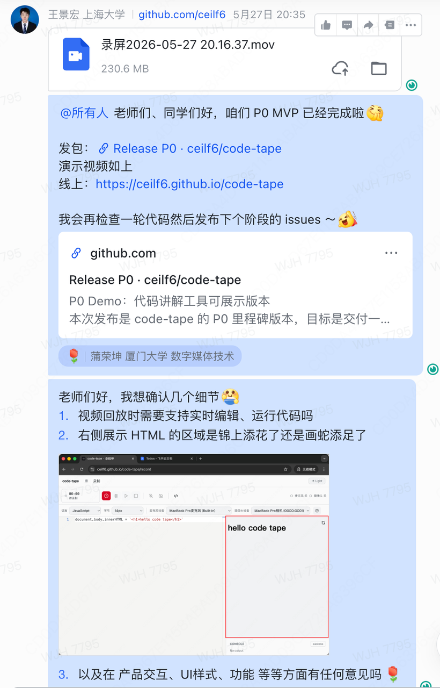

* **5.27** P1+ AI字幕 https://github.com/ceilf6/code-tape/releases/tag/P1-AI

* **5.30** P1 云端 https://github.com/ceilf6/code-tape/releases/tag/P1-Cloud

* **5.30** P1+ 面试 https://github.com/ceilf6/code-tape/releases/tag/P1-Interview

* **5.31** 录制体验、AI 字幕、运行沙箱与多语言编辑器升级 https://github.com/ceilf6/code-tape/releases/tag/recording-ai-runtime-workspace-upgrades

* **6.1** 回放封面、活动时间轴、运行面板与工作流稳定性优化 https://github.com/ceilf6/code-tape/releases/tag/playback-library-runtime-workflow-polish

* **6.1** 稳定版：多语言录制、运行沙箱、云端封面与回放交互修复 https://github.com/ceilf6/code-tape/releases/tag/stable-web-language-runtime-cloud-fixes

* **6.2** 稳定版：外部 ASR、封面导入导出与录制权限修复 https://github.com/ceilf6/code-tape/releases/tag/stable-external-asr-thumbnail-permission-fixes

确保了在新增功能出现异常后能够及时回滚到上一个稳定版本


### 1.3、FrontAgent + Skills

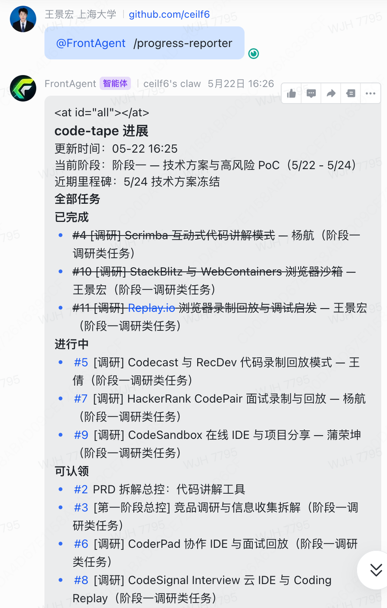

同时为了方便团队同步进度和风向，我将我的个人代理 [FrontAtAgent](https://github.com/ceilf6/FrontAgent) 接入了飞书开放者平台后导入群聊中，作为群助手辅助大家工作，并用 [ceilf6-skills/skill-lifecycle](https://github.com/ceilf6/ceilf6-skills/tree/main/skill-lifecycle) 创建了工作进度汇报技能 [progress-reporter](https://github.com/ceilf6/code-tape/tree/main/skills/progress-reporter) （前面链接的项目都是我之前日常开发、维护的，没有占用工训营过程中的时间，开箱即用了）

那么每天早上 10 点群助手 FrontAgent 就会执行 /progress-reporter cron 定时任务向老师和同学们同步当前项目进展、假如有预警也能及时提醒

在项目后期我又创建了 [semgrep-scanner](https://github.com/ceilf6/code-tape/tree/main/skills/semgrep-scanner) 静态代码分析技能，用于及时排查仓库中的 Blocker 和 Critical 问题


### 1.4、技术选型与敲定方案

在有技术模块拆解后，如果没有确定模块间的边界与字段交互那么大家开发起来仍然是云里雾里

于是在第一阶段也就是竞品信息收集、产出了文档[ 竞品分析](https://my.feishu.cn/wiki/Dxg3wDGJpiKBE5kYJzXcWxUvnnp)之后，我利用仓库的 [discussions](https://github.com/ceilf6/code-tape/discussions)（详情可以查看 [附录 B](https://my.feishu.cn/wiki/MJyowcvIEiIs8okYE3tcjHIZngQ#share-SufTd4crEoL30zxcl6mc4WxnnLG)）同大家进行了技术栈的选型与最终技术方案的敲定，确保了决策信息的可回溯、沉淀进入项目的**知识库**（这一点会在下面 Harness 工程中提到）

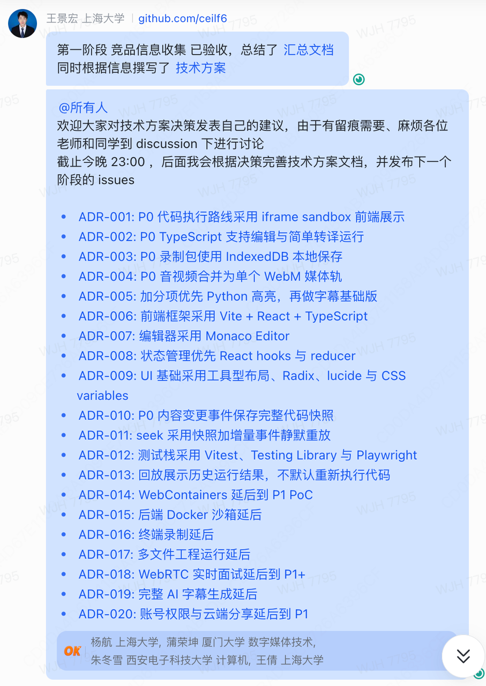

最终得到了文档[ 技术方案](https://my.feishu.cn/wiki/Ifu1wXrt4iUVYOksPXdcomB0nYc)，他是项目的开发基准，我在仓库基建 - 工程**提示词**中是这么强调的

```text
# 文档
1. docs/PRD.md 文档的权威性是最高的
2. 提交的代码不准背离 docs/技术方案.md 。若认为技术方案有任何错误，应通过 discussion 及时上报仓库维护者
```


## 2、仓库 Harness 工程

在学习了 https://www.anthropic.com/engineering/effective-harnesses-for-long-running-agents、https://openai.com/index/harness-engineering/、https://ghuntley.com/loop/ 等文章后，我认为，过往像 skill, MCP 等基本都是对模型前序输入进行控制，而现在 Harness 本质是带上了对模型**输出**的管控，并再次反馈给输入，从而形成一个良性循环

这点在 Claude Code 源码的工程化中也有所体现，我也曾对此做过博客分享 https://blog.csdn.net/2301\_78856868/article/details/159995844


### 2.1、repo-guard

> 🛡️ [<u>ceilf6/repo-guard</u>](https://github.com/ceilf6/repo-guard)

这是我之前闲来无事时开发的，没想到在这次项目中起到了这么大的作用，在咱们百余个 PR 中发表审批 300+ ，采纳率超 95%

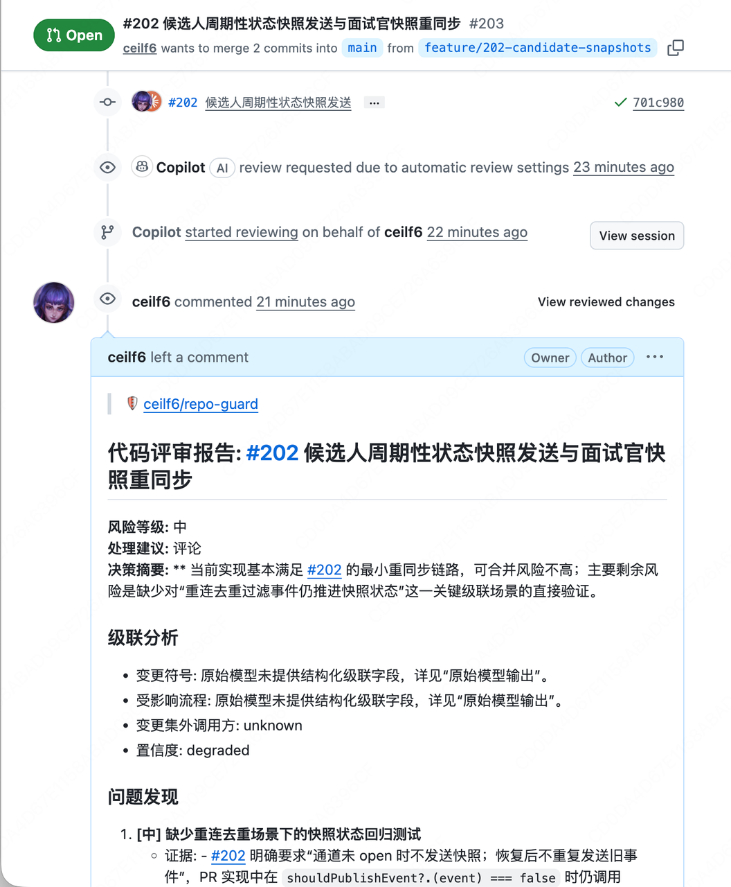

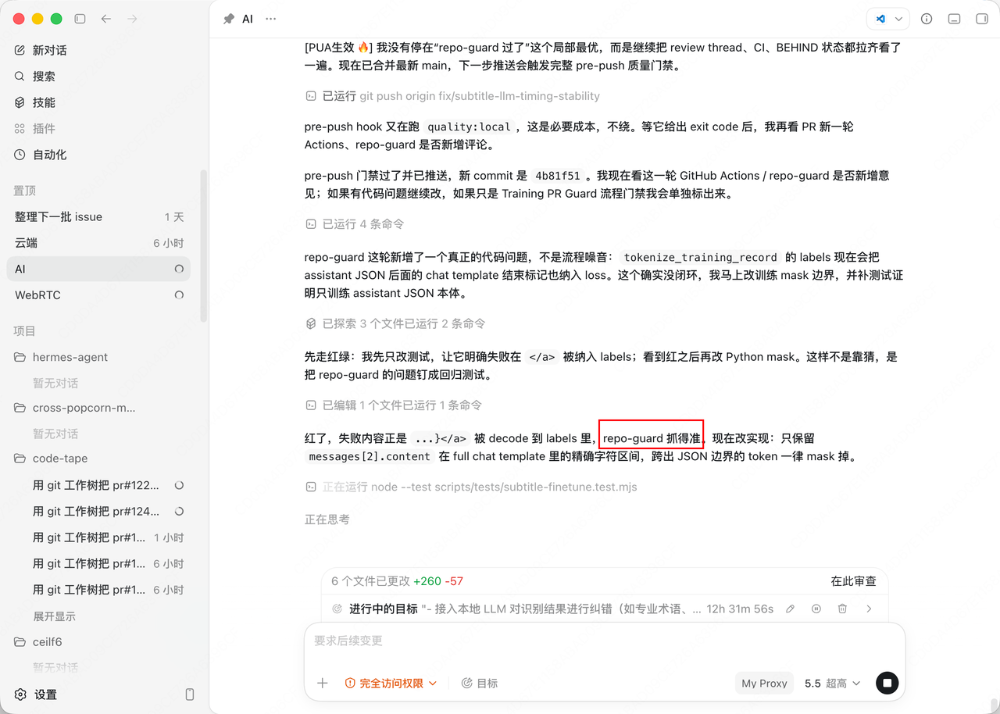

同时我用我的 github pro 账号和 gpt plus 账号为仓库开启了 copilot 和 codex 的 CR，这三重保障、对抗式 CR 确保每一份合入代码的高质量

同时我在工程提示词中强调

```markdown
# 工作
1. 每次开始任务前必须运行 `npm run quality:predev`
2. 在改代码前必须先运行 `npm run agent:bootstrap`
3. 创建分支以 feature/ , fix/ 或 chore/ 开头
4. 使用 Karpathy Guidelines 技能确保代码改动的高质量、精确性
5. 前端 UI 设计使用 frontend-design 技能
6. 启动本地 web dev server 必须用 `npm run dev`
7. 在改动后必须阅读 GitNexus 的建议
8. 发起 PR ，然后等待 GitHub Actions 运行（不用理会“需要CR通过”的错误，这是正常的）、repo-guard 和 codex 以及 Copilot 的评论后进行审查
```

这样能确保代理不是说在完成任务之后就直接结束，而是会等待 repo-guard、codex、copilot 等评审的意见并继续完善、然后继续等待下一次评审这样的循环

像 Agent 循环的中断条件是 LLM 不再 tool\_call ，咱们 PR + CR 良性循环的中断条件就是所有评审对本次任务关联 issue 以及每次更新 diff 和整个 PR 完整上下文不再有 bug comment

其中 repo-guard 的 CR 技能使用的是我之前开发的 [<u>ceilf6-skills/code-reviewer</u>](https://github.com/ceilf6/ceilf6-skills/tree/main/code-reviewer)


### 2.2、知识库

我对项目 Harness Wiki 知识库构建初次选定了 GitNexus 和 OpenViking 两个工具。前者反馈每次代码改动的级联反应、辅助 CICD 把控整体质量；后者为开发代理提供仓库的渐进式上下文和持久化记忆

但是由于 OpenViking 需要挂载服务，还需要和组员们沟通使用方式，考虑到人员和时间的因素，不适合本项目快速交付的需要故而取消其候选资格

于是目前仓库中接入了 GitNexus ，其通过启动 MCP server 为开发 Agent 暴露了一系列的工具进行探测当前代码开发改动是否会影响项目的整体性，具体可以查看沉淀文档[ 知识库](https://my.feishu.cn/wiki/Y1z8wGnomiD3DCkyMFdc9jfgnjf)


### 2.3、Git hooks

在我进行仓库工程基建时，沉淀了很多确保质量的脚本

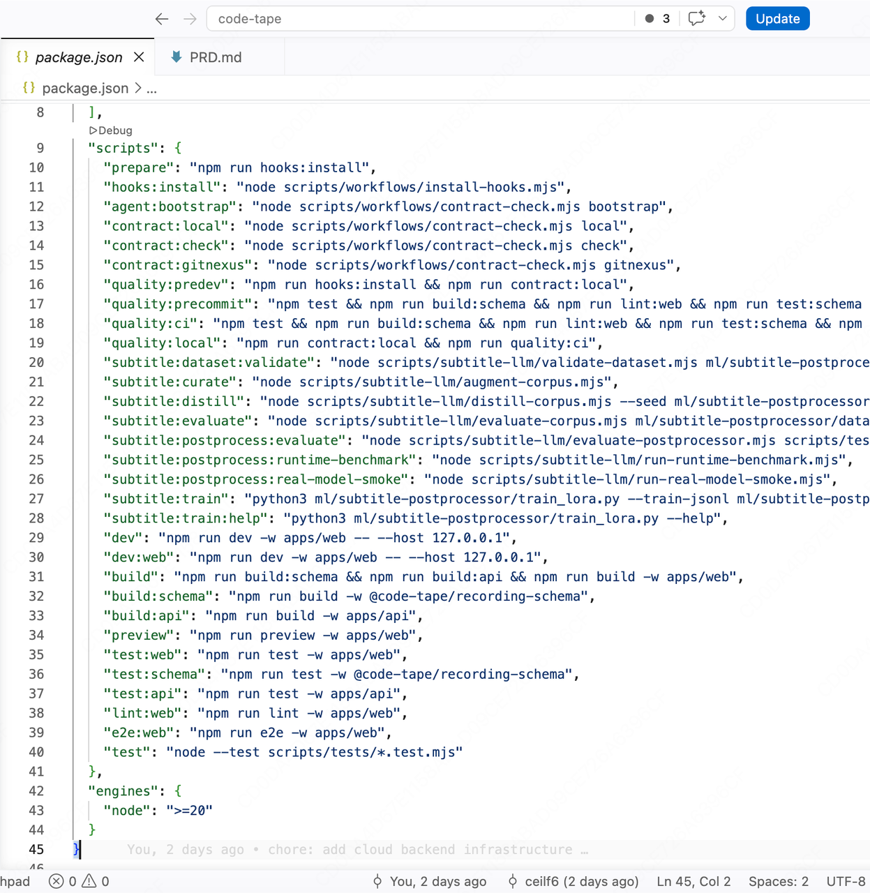

其中就包括 .githooks/ 目录下的 pre-commit 和 pre-push ，他们分别是在代码的提交和代码的推送前要求大模型执行的

* `npm run quality:precommit` 覆盖了仓库测试、Web lint、Web 单测和构建

* `npm run quality:local` 要求刷新 GitNexus 索引并执行完整本地质量闸门


### 2.4、SDD

这部分和前面文档沉淀有所重叠，因为规范驱动开发的本质就是通过规范让大模型能在预期范围进行预期的改动，所以主要就是体现在通过 PRD 和技术方案等基建知识为大模型活动确定了规范

同时开发中还使用 /using-superpowers 等 spec Skills 配合 OpenSpec-cli 工具确保模型的执行是真正考虑到了方方面面（头脑风暴等技能）、同时也是符合开发者意愿的（收尾等技能）


### 2.5、TDD

本仓库中已经沉淀有几百个测试文件，就是 Agents 在开发过程中通过不断 **红灯->绿灯->重构** 并配合 Karpathy-Guidelines 技能确保了代码改动的高质量、精确性

这些测试文件还会在上面提到的 githooks 中运行，保证了当前的改动不会影响之前的功能（敏捷开发的增量性）


# 二、开发者身份

从 [工作量统计文档](../../workload-report.md) 和仓库的 [Insights](https://github.com/ceilf6/code-tape/pulse) 可以看出，我不仅负责仓库基建，也直接参与了 P0 主链路、P1 云端能力和 P1+ 加分项的核心开发。

其中 [workload-report.md](../../workload-report.md) 里统计到：我对应 GitHub ID `ceilf6`，工作量得分 **144.00**。前期我先完成了竞品调研 [#8](https://github.com/ceilf6/code-tape/issues/8) / [PR #16](https://github.com/ceilf6/code-tape/pull/16)、[#10](https://github.com/ceilf6/code-tape/issues/10) / [PR #14](https://github.com/ceilf6/code-tape/pull/14)、[#11](https://github.com/ceilf6/code-tape/issues/11) / [PR #12](https://github.com/ceilf6/code-tape/pull/12)，再落地 P0 技术方案与模块接口设计 [#40](https://github.com/ceilf6/code-tape/issues/40) / [PR #53](https://github.com/ceilf6/code-tape/pull/53)。下面开发者身份部分，我把和自己直接相关的 issue / PR 也补进对应模块里，方便回溯。

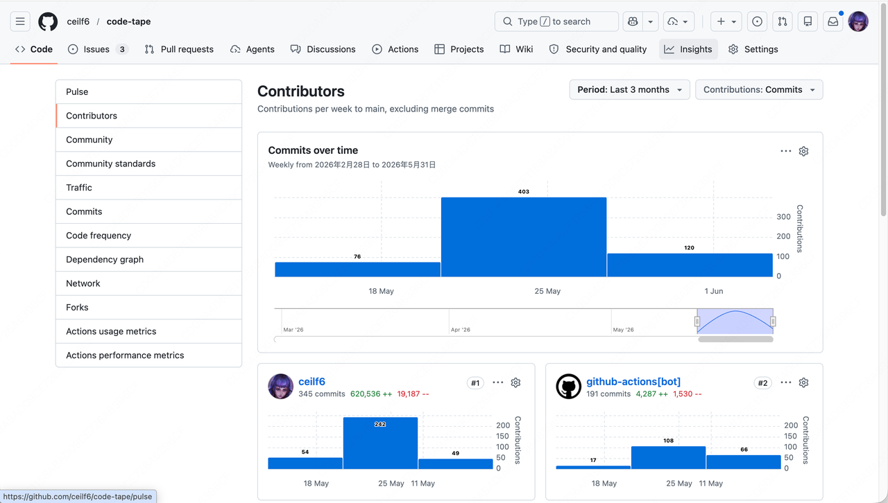


## 1、P0 MVP 基础功能

效果演示：

[录屏2026-05-27 20.16.37.mov]()

P0 阶段的问题不是“做一个普通代码编辑器”，而是验证 PRD 中“代码讲解可以被结构化录制并交互回放”这条主链路。两周周期内如果同时追求完整 IDE、后端沙箱、多文件工程和云端能力，很容易把 Demo 做散。

所以我把 P0 取舍收敛为“事件流优先、音视频辅助、iframe 沙箱展示、本地录制包优先”：先保证录制者能写代码、运行代码、讲解、开关摄像头与麦克风，结束后生成录制包；观看者再通过播放器按时间轴还原代码变化、鼠标轨迹、光标选区、快捷键、运行结果和摄像头画面。


### 1.1、编辑器与运行沙箱

这里的问题是编辑器不能只是一个输入框，它必须同时承担“可写代码”和“可采集事件”两个职责。取舍上我没有自己造编辑器，而是接入 Monaco Editor，让项目从静态 scaffold 进入真正可编辑、可录制的代码工作台。

实现上，编辑器支持 JS / TS 语法高亮、基础补全、语言切换、字号与主题等基础设置，并为内容变更、选区、快捷键采集提供稳定入口。代码运行没有选择高风险的后端容器沙箱，而是按 PRD “前端代码页面展示”路线，采用 iframe sandbox + postMessage 的前端运行方案。

兜底上，P0 不承诺 Docker 隔离、多语言执行、npm 依赖和完整工程运行。运行预览层把 HTML / CSS / JS 组织进 sandbox iframe 的 body / style / script 执行上下文；TypeScript 先做浏览器侧 transpile，再作为 JS 注入运行。

对应落地：

* [#55](https://github.com/ceilf6/code-tape/issues/55) / [PR #61](https://github.com/ceilf6/code-tape/pull/61) Monaco CodeEditor 基础集成

* [#56](https://github.com/ceilf6/code-tape/issues/56) / [PR #64](https://github.com/ceilf6/code-tape/pull/64) RuntimeProducer 实装：运行事件写入事件流

* [#235](https://github.com/ceilf6/code-tape/issues/235) / [PR #236](https://github.com/ceilf6/code-tape/pull/236) HTML / CSS 渲染运行与 Python 高亮扩展


### 1.2、结构化录制链路

P0 最关键的问题是：录制的不是视频，而是带时间戳的事件流。如果事件时间、暂停偏移、媒体状态和编辑器状态分散在不同组件里，后续 seek 和回放一定会乱。

所以我选择把 `RecordingClock`、`EventBus`、`RecordingController` 和 `PackageBuilder` 作为录制事实源，编辑器内容、光标选区、滚动、鼠标轨迹、快捷键、运行结果、媒体状态都统一写入录制事件。

实现上，录制总控支持开始、暂停、继续、停止，并在录制过程中显示时长。媒体部分通过浏览器 MediaStream / MediaRecorder 采集麦克风和摄像头，并提供摄像头悬浮预览、开关与权限提示。录制结束后生成包含 meta、events、snapshots、media、manifest 的本地录制包。

兜底上，本地包优先保存到 IndexedDB，同时提供导入导出和 quota 预检 / ZIP 兜底，避免 Demo 现场因为浏览器存储失败直接断链。

对应落地：

* [#57](https://github.com/ceilf6/code-tape/issues/57) RecorderControls 录制控制条 UI

* [#60](https://github.com/ceilf6/code-tape/issues/60) CameraPreview 悬浮预览 UI

* [#65](https://github.com/ceilf6/code-tape/issues/65) / [PR #68](https://github.com/ceilf6/code-tape/pull/68) editorProducer：内容/选区/滚动/语言事件采集

* [#66](https://github.com/ceilf6/code-tape/issues/66) pointerProducer + shortcutProducer

* [#67](https://github.com/ceilf6/code-tape/issues/67) mediaProducer：媒体开关、权限告警与摄像头位置事件

* [#77](https://github.com/ceilf6/code-tape/issues/77) 录制保存 quota 预检与 ZIP 兜底提示

* [#215](https://github.com/ceilf6/code-tape/issues/215) / [PR #216](https://github.com/ceilf6/code-tape/pull/216) 修复编辑器格式化快捷键与缩进行为


### 1.3、交互式回放链路

回放的问题是 seek：用户拖动进度条时不能从头线性播放到目标时间，也不能重新执行历史代码，否则结果不稳定、风险也更大。

所以我选择围绕 `ReplayScheduler` 和 `ReplayReducer` 做回放：播放器读取录制包中的事件、快照和历史运行结果，通过统一时间轴恢复任意时间点的稳定状态。

实现上，回放页支持播放、暂停、继续、倍速、进度条 seek、音量调节和静音；画面上同步还原编辑器内容变化、鼠标激光笔、光标选区、快捷键浮层、运行输出和摄像头视频。兜底上，如果媒体缺失，回放仍然保留纯事件流体验，不因为视频文件失败就放弃代码过程。

对应落地：

* [#58](https://github.com/ceilf6/code-tape/issues/58) ReplayControls 播放控制条基础交互

* [#59](https://github.com/ceilf6/code-tape/issues/59) RecordingLibraryPage 列表 UI 与导入导出入口

* [#76](https://github.com/ceilf6/code-tape/issues/76) / [PR #80](https://github.com/ceilf6/code-tape/pull/80) ReplayScheduler 接入媒体主时钟与 buffering 状态

* [#79](https://github.com/ceilf6/code-tape/issues/79) 回放缺失媒体降级提示与纯事件流体验

* [#219](https://github.com/ceilf6/code-tape/issues/219) / [PR #220](https://github.com/ceilf6/code-tape/pull/220) 提升回放帧率与播放流畅度

* [#248](https://github.com/ceilf6/code-tape/issues/248) / [PR #249](https://github.com/ceilf6/code-tape/pull/249) 修复回放结束后再次播放不从头开始

* [#274](https://github.com/ceilf6/code-tape/issues/274) / [PR #275](https://github.com/ceilf6/code-tape/pull/275) 修复回放进度条显示与拖拽状态异常


### 1.4、端到端验收与质量保障

P0 的验收风险是“模块都能跑，但主链路演示不出来”。所以我把验证重点放在端到端闭环，而不是只测单个组件。

实现上，我补齐了录制到回放的 Playwright e2e，用真实浏览器路径验证“开始录制 -> 写代码 -> 运行 -> 停止 -> 保存 -> 进入回放 -> 播放/seek”。同时，仓库围绕 editorProducer、pointerProducer、shortcutProducer、mediaProducer、packageBuilder、recordingStore、ReplayScheduler、ReplayControls 等核心模块建立了单测和集成测试。

兜底上，事件流、录制包和回放调度这些高风险部分不靠手测维持，而是进入仓库质量闸门。

对应落地：

* [#78](https://github.com/ceilf6/code-tape/issues/78) / [PR #83](https://github.com/ceilf6/code-tape/pull/83) 录制到回放主链路 Playwright e2e

* apps/web 下已有 62 个测试文件，其中包括 3 个 e2e spec

P0 阶段的结果是：项目已经从“方案和组件集合”推进到“可展示的代码讲解录制回放 Demo”。这条链路也为后续 P1 云端回放中心、P1+ WebRTC 实时面试和 AI 字幕留下了扩展点。


## 2、云端

> 总控 issue: [#92](https://github.com/ceilf6/code-tape/issues/92)

效果演示：

[录屏2026-05-30 17.40.47.mov]()

在 P0 主链路完成后，我开始推进 P1 云端回放中心。这里的问题是：如果云端重新定义一套录制格式或播放器，就会和 P0 本地回放产生两套事实源，后续一致性和维护成本都会很高。

所以我在云端部分坚持一个边界：云端只负责上传、鉴权、对象存储、校验、索引、播放描述、分享和删除生命周期；真正的回放仍然复用本地 `RecordingPackageV1`、事件流、快照、历史运行结果和 `ReplayScheduler`，不重新执行历史代码。


### 2.1、身份认证

早期 Demo 用 `x-owner-token` 做隔离，但问题是长期设备标识会出现在每个业务请求里。取舍上我没有把完整登录体系前置到 P1，而是把匿名身份升级成 refresh token / access token 两段式：长期设备 token 只用于换短期 Bearer token，真正的云端业务请求只带短期 token。

实现上，前端会在本地持久化一个 64 位 hex 设备 token，把它当作 refresh token，只在 `/api/auth/token` 里换取短期 Bearer access token；上传、列表、播放、重命名、删除、分享这些业务请求只带 `Authorization: Bearer ...`。

服务端的 access token 是 `payload.signature` 结构，payload 里包含 `ownerId / iat / exp`，signature 用 HMAC-SHA256 签名，默认 15 分钟过期。前端会在过期前刷新，遇到 401 也会强制刷新并重试一次；如果刷新失败，不会退回去把长期设备 token 直接发给业务接口。

兜底上，服务端保留了 `x-owner-token` 的兼容路径，但只服务旧客户端。当前新版链路已经把“长期身份标识”和“业务访问令牌”拆开了，后续如果要接企业登录，也可以把 ownerId 的来源替换成真实账号，而不需要重写云端回放主链路。

对应落地：

* [#231](https://github.com/ceilf6/code-tape/issues/231) / [PR #232](https://github.com/ceilf6/code-tape/pull/232) 云端身份认证：长期 refresh token 换取短期签名 access token

* `AuthTokenService`：签发和校验短期 Bearer token

* `CloudRecordingRepository`：业务请求自动携带 access token，401 后刷新重试


### 2.2、云端上传与状态机

云端上传的问题是大媒体文件不能直接让 API 进程吞吐，而且上传失败、重复点击、对象损坏都需要可恢复。取舍上我采用 upload session 模型，把业务元数据和对象上传分离。

实现上，前端先把本地录制包拆成 `manifest / meta / events / snapshots / indexes / media / thumbnail` 等资产，逐个计算 sha256 和 size，再创建上传会话。服务端返回每个资产的 PUT upload target，前端直接把大对象上传到对象存储，最后调用 complete 触发校验。

这个设计主要解决两个问题：

1. API 进程不直接吞吐完整媒体 Blob，后续可以自然迁移到 S3 兼容对象存储、签名 URL 和 multipart 上传。

2. 上传会话带 `idempotencyKey`，断网重试时可以复用同一 session，不会因为重复点击上传污染云端列表。

服务端状态机现在是 `uploading -> processing -> ready / failed`。validation worker 会读取对象存储里的资产，校验必需资产、checksum、schema、录制时长、事件数量和包大小；其中必需资产是 `manifest / meta / events / snapshots`，`indexes / media / thumbnail` 是可选资产。当前预算是录制时长 15 分钟、事件 20000 条、媒体 200MB、总资产 250MB。

兜底上，缺媒体时不会直接拒绝包，而是进入纯事件流回放能力。本地开发环境也补了对象存储 HTTP 适配层：PUT 上传、GET 下载、一次性 upload token、content-type 校验、上传大小限制和 CORS preflight 都有覆盖，保证前端本地调试和线上对象存储的行为尽量一致。

对应落地：

* [#94](https://github.com/ceilf6/code-tape/issues/94) Upload Session complete HTTP API

* [#96](https://github.com/ceilf6/code-tape/issues/96) 本地开发对象存储 HTTP 适配层

* [#97](https://github.com/ceilf6/code-tape/issues/97) 云端录制包预算校验与缺媒体降级

* [#117](https://github.com/ceilf6/code-tape/issues/117) CloudRecordingRepository 上传与状态轮询

* [#174](https://github.com/ceilf6/code-tape/issues/174) / [PR #198](https://github.com/ceilf6/code-tape/pull/198) 云端回放中心主链路验收与回归矩阵


### 2.3、云端列表、播放、分享与删除

云端列表的问题是它不能只是“文件存上去了”，还必须能稳定播放、分享、删除，并且不能把未校验或已删除的录制暴露出来。取舍上我只让 ready 录制进入云端列表，上传中和 failed 状态不污染用户的正常观看入口。

实现上，前端回放中心有“本地录制 / 云端录制”两个 tab。本地录制可以上传到云端，上传时显示进度，完成后轮询云端校验状态；云端列表展示标题、封面、创建时间、时长、语言、音频和摄像头能力，并支持在线播放、重命名、删除和复制分享链接。

播放时前端不是直接拼对象 URL，而是先请求 playback descriptor。descriptor 会返回 `manifestUrl / metaUrl / eventsUrl / snapshotsUrl / indexesUrl / mediaUrl / thumbnailUrl` 以及过期时间；`CloudPackageLoader` 下载这些资产后，仍然走本地录制包完整性校验和 `ReplayScheduler` 播放。

分享链路也补齐了：owner 可以创建 `/s/:token` 形式的公开只读分享链接，并且可以带 `?t=` 时间点。分享播放不需要 owner token，服务端只用 token hash 找到 share link，再返回短期 playback descriptor；录制被软删后，关联分享链接会一起撤销。

兜底上，`indexes` 缺失时可以重建索引，`media` 缺失时降级成纯事件流回放。删除采用幂等 soft delete：第一次删除把状态改成 `soft_deleted`，写入 `deletedAt` 和 `purgeAfter`，列表、播放和分享立即不可见；重复删除会返回同一个软删结果，不会产生额外副作用。后续保留期结束后再进入对象清理流程。

对应落地：

* [#95](https://github.com/ceilf6/code-tape/issues/95) 云端录制状态与列表 API

* [#118](https://github.com/ceilf6/code-tape/issues/118) 云端播放描述 API

* [#119](https://github.com/ceilf6/code-tape/issues/119) 云端录制重命名与软删除 API

* [#147](https://github.com/ceilf6/code-tape/issues/147) / [PR #155](https://github.com/ceilf6/code-tape/pull/155) CloudPackageLoader 云端录制包加载

* [#158](https://github.com/ceilf6/code-tape/issues/158) / [PR #161](https://github.com/ceilf6/code-tape/pull/161) 云端播放页接入

* [#166](https://github.com/ceilf6/code-tape/issues/166) / [PR #167](https://github.com/ceilf6/code-tape/pull/167) 云端回放中心页面入口与本地上传

* [#169](https://github.com/ceilf6/code-tape/issues/169) / [PR #172](https://github.com/ceilf6/code-tape/pull/172) 时间点分享链接 API 与播放入口

* [#258](https://github.com/ceilf6/code-tape/issues/258) / [PR #259](https://github.com/ceilf6/code-tape/pull/259) 补齐分享链接时间点回放前端回归


### 2.4、部署服务器

云端能力的最后一个问题是：不能只停留在本地联调，必须有一个公网可访问的环境来验证上传、鉴权、列表和播放描述 API。取舍上我没有额外搭复杂运维环境，而是先用 Render Web Service 承载 P1 Demo。

实现上，我在 https://render.com/ 中新建 Web Service，连接 GitHub 仓库 ceilf6/code-tape，配置构建命令、启动命令和 Node 20，完成后得到线上部署地址 https://code-tape.onrender.com/。

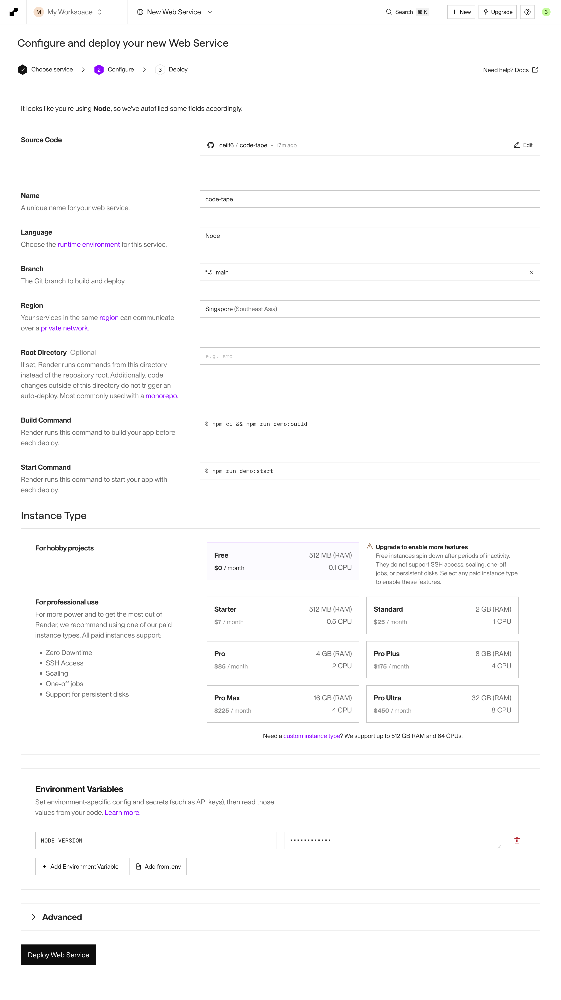

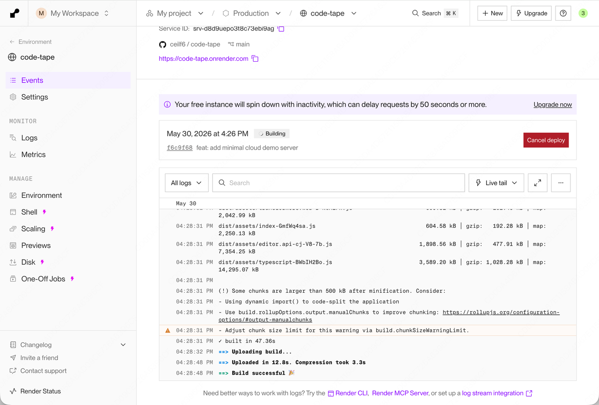

兜底上，线上验证不再走旧版 `x-owner-token`，而是先换取短期 Bearer token，再访问云端列表 API，确认新版鉴权链路可用。

验证请求：

```text
TOKEN=$(curl -s https://code-tape.onrender.com/api/auth/token \
  -H 'content-type: application/json' \
  -d '{"refreshToken":"demo-owner-token"}' | jq -r .accessToken)

curl -i https://code-tape.onrender.com/api/recordings \
  -H "Authorization: Bearer $TOKEN"
```

示例响应：

```json
{"items":[],"nextCursor":null}
```


## 3、AI 本地字幕

效果演示：

[3970794357.mov]()

我自学过神经网络、机器学习相关内容，之前也进行过前端侧专业知识模型微调 **https://hf.co/collections/ceilf6/frontagent-frontend-engineering-agent**&#x20;

所以对这部分还是比较熟悉的。我把问题拆成两段：ASR 负责把音频变成带时间戳的字幕，LLM 负责把字幕里的代码术语、变量名和章节边界修正好。流程就是：音频 Blob -> @huggingface/transformers -> Whisper/ONNX -> 浏览器本地 WASM/ONNX Runtime 推理；LLM 只做 ASR 后处理，不替代 Whisper 转写。

这部分我认为的技术难点主要在于模型输出稳定性、加载性能和浏览器资源竞争。


### 3.1、LLM 微调

这里的问题是隐私和效果之间的矛盾：字幕内容和代码上下文都比较敏感，最好在用户浏览器本地跑；但浏览器本地模型参数不能太大，章节划分和代码术语纠错又很吃模型能力。

所以我的取舍是：ASR 用公开 Whisper tiny 先保证字幕主链路，本地 LLM 则通过 teacher model 蒸馏和前端语料微调，提高它对 code-tape 场景的适配度。

实现上，蒸馏数据生成器从 seed 样本调用 teacher API，产出 SFT JSONL；训练语料覆盖 React、TypeScript、Vite、Playwright、Web Worker、IndexedDB、repo-guard、SubtitlePanel 等项目关键场景。

在我自己的中文代码讲解样本上，Whisper tiny 的原始 ASR 已经能覆盖大部分内容，但代码术语、变量名和章节边界仍需要 LLM 后处理。后续我用更强的 teacher model 生成字幕纠错与章节样本，再结合前端相关语料进行微调训练，拿到了适配咱们项目的 ONNX 模型。

[**https://hf.co/collections/ceilf6/code-tape**](https://hf.co/collections/ceilf6/code-tape)

不过我跑了一晚上的语料生成和训练优化，早上测试后发现，“纠错并生成章节”的实际效果还是不太理想，尤其是在

1. 章节划分和语义纠错的稳定性

2. 加载模型权重需要很长时间（我试过直接把模型直接打入 JS bundle 发现首屏响应时间长的离谱\[捂脸]）

3. 现在 LLM 已经放进 Web Worker，但 WASM/WebGPU 仍会吃 CPU/GPU/内存带宽，会和视频解码、浏览器渲染抢资源

兜底上，我没有只从“继续加语料”这个方向硬冲，而是回到 schema 约定排查。我发现输入和输出都叫 `segments`，但输入段带 `startMs/endMs/text`，输出段只能是 `id/text`，小模型很容易直接复制输入 schema，导致缺 text、带 startMs/endMs 的坏 JSON。后面我把训练和运行时的输入字段改成 `inputSegments`，让输出专用 `segments`，新一版 v6 在同一组 30 个真实生成探针上达到了 30/30 可解析 JSON，而前一版 v5 只有 24/30。

对应落地：

* [#98](https://github.com/ceilf6/code-tape/issues/98) / [PR #102](https://github.com/ceilf6/code-tape/pull/102) 本地 AI 字幕生成与回放交互

* [#110](https://github.com/ceilf6/code-tape/issues/110) / [PR #109](https://github.com/ceilf6/code-tape/pull/109) AI 字幕 LLM 纠错与章节生成补齐

* [#133](https://github.com/ceilf6/code-tape/issues/133) / [PR #123](https://github.com/ceilf6/code-tape/pull/123) AI 字幕本地 LLM 稳定性与语料质量优化

* [#135](https://github.com/ceilf6/code-tape/issues/135) / [PR #145](https://github.com/ceilf6/code-tape/pull/145) AI 字幕纠错与章节效果评测基线

* [#187](https://github.com/ceilf6/code-tape/issues/187) / [PR #188](https://github.com/ceilf6/code-tape/pull/188) AI 字幕默认 LLM 真实模型 smoke 性能基线


### 3.2、LLM 增量支持

在本地 LLM 能跑通后，我又遇到了一个现实问题：ASR 字幕生成比较稳定，但是“纠错 + 章节生成”这一步很容易因为浏览器本地模型太小、token 预算太紧、WASM/WebGPU 抢资源而超时或输出坏 JSON。

所以我没有直接推翻本地模型路线，而是做了一个增量取舍：**外部大模型优先，本地微调模型兜底**。

实现上，如果用户没有配置外部大模型，就继续走本地模型；如果配置了 OpenAI 兼容接口或 Anthropic，就优先请求外部模型，用更强的提示词完成术语纠错和章节生成。

这里需要说明一下 CORS：它不是为了“保护 API Key”，而是浏览器在保护跨域访问边界。模型请求会带 `Authorization`、`x-api-key`、`content-type: application/json` 这类非简单请求头，所以浏览器会先发 preflight；只有目标模型接口允许当前页面跨域访问，真正请求才会继续，页面也才能拿到结果。因此页面里强调要填写“支持浏览器跨域（CORS）的请求地址”。

兜底上，外部请求失败、超时、返回非法 JSON，或者接口不支持浏览器跨域时，系统会自动回退本地模型，保证字幕和回放不会被中断。Key 的风险控制不靠 CORS，而是靠“不进仓库、不打进 bundle、不发给 code-tape 后端”：目前 Key 只保存在用户本机 `localStorage`；HTTP 错误也不读取响应体，避免错误配置的网关把 Key 或字幕上下文回显出来。

对应落地：

* [#150](https://github.com/ceilf6/code-tape/issues/150) / [PR #153](https://github.com/ceilf6/code-tape/pull/153) AI 字幕 LLM 后处理阶段耗时与超时兜底

* [#157](https://github.com/ceilf6/code-tape/issues/157) / [PR #159](https://github.com/ceilf6/code-tape/pull/159) AI 字幕长轨分块后处理，降低本地 LLM JSON 与 segment 引用失败

* [#178](https://github.com/ceilf6/code-tape/issues/178) / [PR #180](https://github.com/ceilf6/code-tape/pull/180) 压缩字幕 LLM 输入以降低延迟和错段引用

* [#196](https://github.com/ceilf6/code-tape/issues/196) / [PR #197](https://github.com/ceilf6/code-tape/pull/197) 中长字幕轨按 60 段窗口分块后处理

* [#227](https://github.com/ceilf6/code-tape/issues/227) / [PR #228](https://github.com/ceilf6/code-tape/pull/228) 字幕 LLM 后处理：支持外部大模型接入 + 本地模型兜底

* `SubtitleLlmConfigButton`：配置 OpenAI 兼容 / Anthropic、Base URL、API Key、Model

* `externalLlmSubtitlePostProcessor`：按 provider 生成请求，统一输出 `segments / chapters` JSON

* `fallbackSubtitlePostProcessor`：外部请求非取消类失败时自动回退本地模型


### 3.3、ASR 输出语言

ASR 的问题是语言识别不稳定：调用 `onnx-community/whisper-tiny` 时，如果不显式指定语言，模型很容易把中文讲解识别成英文或拼音，尤其是中英混合的代码术语场景。

所以我的取舍是先固定中文主场景，而不是让模型自动判断语言。实现上，我把 ASR 参数固定为 `task: "transcribe"` 和 `language: "chinese"`，先让 Whisper 明确按照中文讲解去转写；React、TypeScript、useState 这类代码术语，再交给后面的 LLM 后处理修正。兜底上，ASR 只负责带时间戳的原始字幕，LLM 负责术语纠错和章节，不让一个模型同时承担所有职责。

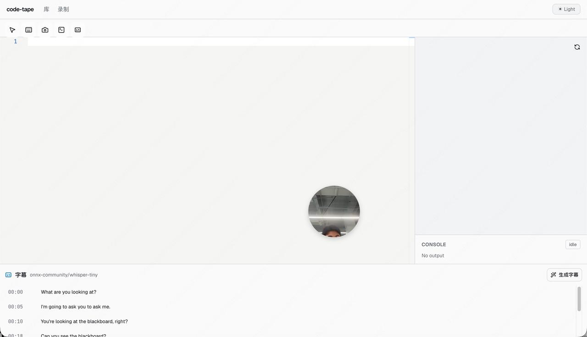

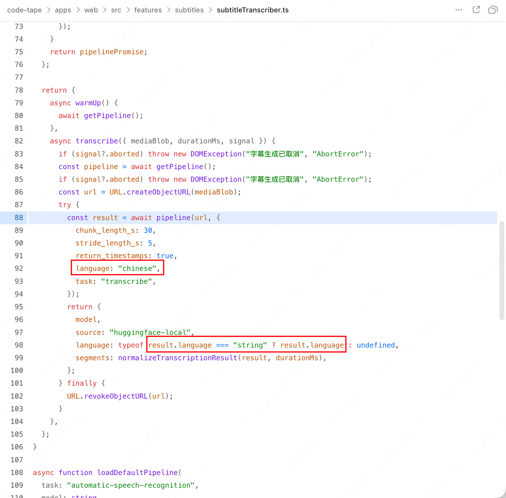

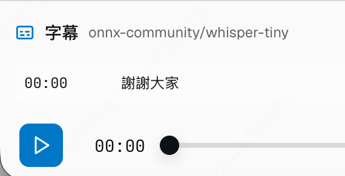


### 3.4、模型托管

在让朋友测试时又发现一个问题：不是每个人的网络都能稳定访问 Hugging Face，模型权重拉不下来，字幕功能就直接卡在加载阶段。

所以我的取舍是让浏览器运行时尽量走同源静态资源，而不是每个用户都去访问 Hugging Face。实现上，我把默认 ASR / LLM 模型资产通过 `npm run subtitle:vendor` 拉到 `apps/web/public/` 下，让线上页面优先从同源静态资源加载；构建前还有 `verify-vendored-assets` 检查，避免模型文件缺失时直接发版。

兜底上，后面我的 Git LFS 达到了上限：

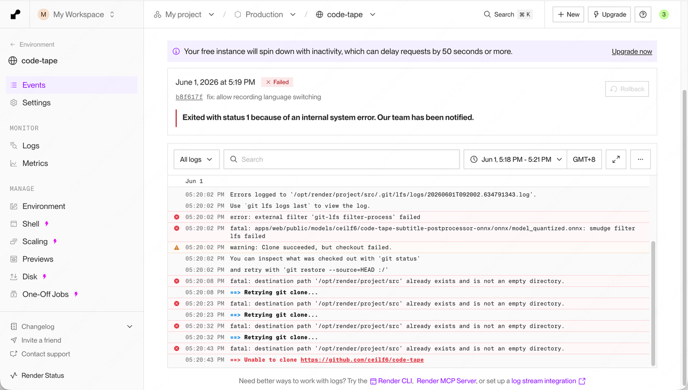

所以我又把策略调整为构建阶段直接从 Hugging Face 拉模型，而不是把大模型资产继续放在 Git LFS 里。这样对最终用户来说仍然是同源加载，对仓库来说也不会继续被 LFS 配额卡住。

对应落地：

* [#164](https://github.com/ceilf6/code-tape/issues/164) / [PR #165](https://github.com/ceilf6/code-tape/pull/165) 生成字幕 Transformers 动态 chunk 加载失败

* [#175](https://github.com/ceilf6/code-tape/issues/175) / [PR #176](https://github.com/ceilf6/code-tape/pull/176) 线上旧 Transformers chunk 失效后生成字幕无法恢复

* [#184](https://github.com/ceilf6/code-tape/issues/184) / [PR #185](https://github.com/ceilf6/code-tape/pull/185) 生成字幕直接加载 Transformers chunk 失败时未触发恢复

* [#190](https://github.com/ceilf6/code-tape/issues/190) / [PR #192](https://github.com/ceilf6/code-tape/pull/192) 修复线上生成字幕的 Transformers stale chunk 恢复

* [#193](https://github.com/ceilf6/code-tape/issues/193) / [PR #194](https://github.com/ceilf6/code-tape/pull/194) 增强纠错并生成章节的 worker stale chunk 恢复覆盖

* [#226](https://github.com/ceilf6/code-tape/issues/226) / [PR #225](https://github.com/ceilf6/code-tape/pull/225) AI 字幕生成报错：huggingface.co 模型下载连接超时

* `scripts/subtitle-llm/vendor-models.mjs`：把模型资产 vendor 到前端 public 目录


### 3.5、产品体验优化

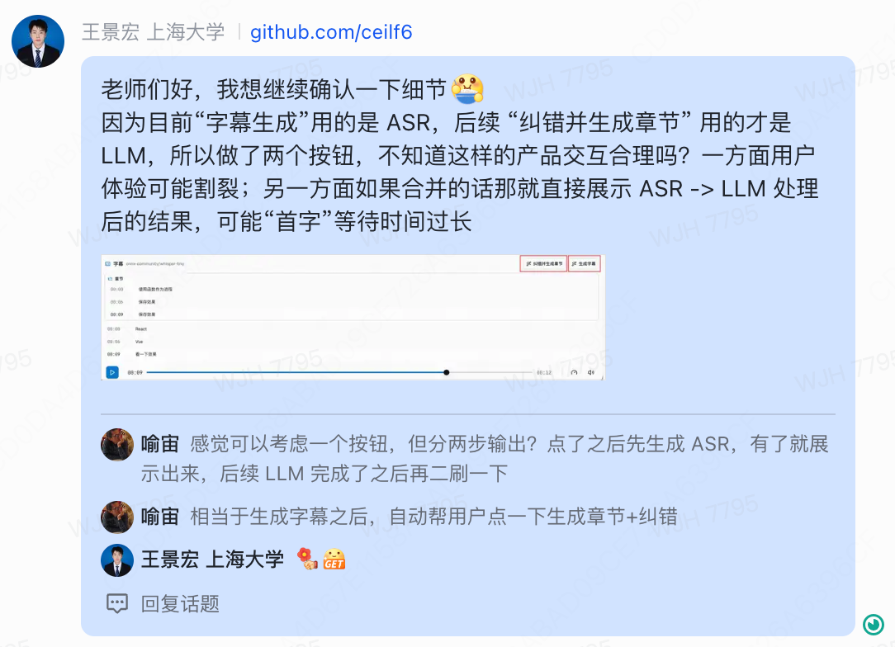

产品体验上的问题是：ASR、LLM 纠错、章节生成如果拆成多个按钮，用户会不知道下一步该点什么，也很难判断“慢”到底是失败还是后台还在跑。

所以感谢 PM 喻宙老师的建议，我把字幕能力从“多个技术按钮”收敛成一个主按钮：用户只需要点击一次，系统先跑 ASR，并且马上把原始字幕展示出来；随后后台继续跑 LLM 纠错和章节生成，成功后自动二刷字幕和章节。

兜底上，即使 LLM 慢或者失败，用户至少已经有可看的字幕；而且字幕行和章节都可以点击 seek，最终还是回到项目最核心的交互式回放体验上。

对应落地：

* [#217](https://github.com/ceilf6/code-tape/issues/217) / [PR #218](https://github.com/ceilf6/code-tape/pull/218) 合并字幕生成与 LLM 纠错章节流程

* [#168](https://github.com/ceilf6/code-tape/issues/168) / [PR #170](https://github.com/ceilf6/code-tape/pull/170) AI 字幕 LLM 空闲预热避免抢占 ASR


## 4、前端沙箱隔离

PRD 里代码执行给了两条路线：后端沙箱执行，或者前端页面展示。这里的问题是安全边界和交付周期冲突：如果一开始就做 Docker / V8 isolate，主链路很容易被沙箱工程拖慢；但如果完全不隔离，用户代码又可能影响宿主页面。

所以我的取舍是：P0 采用 iframe sandbox 前端展示路线，把它明确定位成教学 Demo 级运行预览，不包装成完整的不可信代码安全沙箱。


### 4.1、iframe 沙箱隔离

实现上，可执行 JS/TS 默认创建 `<iframe sandbox="allow-scripts">`，只允许脚本执行，不默认加 `allow-same-origin`、`allow-popups` 等能力，所以用户代码运行在 opaque origin 里面，不能拿宿主同源权限，弹窗也不会按正常浏览器窗口能力开放。

每次运行都会创建新的 iframe 和随机 `runId`，旧的会被 `teardown()` 移除，避免多次运行复用脏状态。`runtimeProducer` 会传入 `timeoutMs`，超时后销毁 iframe，防止 setInterval、异步 flood、DOM 增长等继续消耗资源。

iframe 内的 boot script 会：

* 劫持 console.log/warn/error 并转发给父页面

* 监听同步 error

* 监听 unhandledrejection

* 覆盖 alert/confirm/prompt，改成返回安全值并上报 blocked-alert

兜底上，用户代码触发弹窗不会真的打断宿主 UI，而是变成运行输出里的 blocked 信息。


### 4.2、CSP 策略限制能力

可执行 iframe 的 srcdoc 注入 CSP

```text
default-src 'none'; script-src 'unsafe-inline'; style-src 'unsafe-inline'; img-src data: blob:; connect-src 'none';
```

这部分的取舍是尽量让运行预览只使用本地内联资源。CSP 默认拒绝所有资源，脚本只允许内联执行，样式只允许内联样式，图片只允许 data: / blob: 格式，网络连接被 `connect-src 'none'` 禁用。

在回放时则直接使用 `script-src 'none'` 禁止脚本执行，只展示录制时保存下来的 preview 结果，避免观看者打开回放时重新执行历史代码。


### 4.3、子 -> 父

因为 sandbox iframe 是 opaque origin，子页面向父页面发消息只能用 `postMessage(..., "*")`。问题是 `*` 不能作为信任边界，所以父页面必须自己校验消息来源和结构。

实现上，仓库在父页面做多层校验：

* 消息体 `source` 必须是 `code-tape-runtime`

* 消息体 `runId` 必须匹配当前运行

* 浏览器事件的 `event.source` 必须是当前 iframe 的 `contentWindow`

* `type / payload` 必须符合 schema

* 允许的消息类型只有 `ready`、`console`、`error`、`blocked-alert`、`complete`


### 4.4、父 -> 子

父页面向子页面发送代码时也有类似问题：如果直接靠普通 window postMessage 广播，消息面会比较混杂。

所以实现上，iframe boot 时会创建 MessageChannel，把控制端口交给父页面；后续 init 和 set-theme 都走这个私有 MessagePort，减少普通 window.postMessage 广播带来的混杂风险。


### 4.5、社区成熟 DOMPurify 工具库

静态 HTML / 回放 preview 的问题是：它虽然不执行脚本，但仍然是用户生成内容，不能直接塞进宿主 DOM。

所以实现上，preview 在写入 no-script iframe 前会先用 DOMPurify 清洗，并保留整文档解析能力。兜底上，回放 preview 永远进入 iframe，不写入宿主页面 DOM。


### 4.6、沙箱能力边界

这里必须明确一个边界：iframe sandbox 能降低普通注入、弹窗打断、跨源访问和异步资源消耗风险，但不等于完整恶意代码安全沙箱。比如同步死循环仍然可能卡住同一渲染进程，父页面的 timeout 也不一定能及时执行。

所以 P0 的兜底是刷新恢复和录制包持久化；如果未来要产品化运行不可信长任务，再考虑 Worker、独立 origin iframe 或后端容器隔离。

对应落地：

* [#229](https://github.com/ceilf6/code-tape/issues/229) / [PR #230](https://github.com/ceilf6/code-tape/pull/230) 运行沙箱 DoS 加固：超时必须销毁 iframe + 限制运行输出累积

* [#237](https://github.com/ceilf6/code-tape/issues/237) / [PR #238](https://github.com/ceilf6/code-tape/pull/238) 修复运行预览 iframe 不跟随主题色

* [#265](https://github.com/ceilf6/code-tape/issues/265) / [PR #266](https://github.com/ceilf6/code-tape/pull/266) 增强运行 Console 与错误输出面板

* [#281](https://github.com/ceilf6/code-tape/issues/281) / [PR #282](https://github.com/ceilf6/code-tape/pull/282) 修复 iframe runtime postMessage 通配符目标

* [#292](https://github.com/ceilf6/code-tape/issues/292) / [PR #293](https://github.com/ceilf6/code-tape/pull/293) 使用 DOMPurify 强化静态预览 HTML 清洗


## 5、WebRTC 实时面试

> 总控 issue [#120](https://github.com/ceilf6/code-tape/issues/120)

效果演示：

[2836753921.mov]()

WebRTC 这部分最大的问题是范围控制。如果把它做成多人协同编辑，就必须引入 CRDT / OT、冲突解决和权限模型，复杂度会直接变成协同 IDE。

所以我的取舍是严格收敛成 PRD 里的实时面试模式：候选人是唯一写入者，面试官只是实时只读观察者。

实现上，候选人创建面试房间，后端用 WebSocket 做信令，双方交换 SDP / ICE 后建立 WebRTC；音视频走 WebRTC media track，编辑器事件走 `RTCDataChannel`。WebSocket 只负责房间、身份、SDP / ICE 和控制消息；高频编辑事件走 RTCDataChannel，避免把信令通道变成实时数据通道。

为了复用 P0 主链路，我让候选人端继续使用原来的 `RecordingController`、`EventBus` 和 `PackageBuilder`。`InterviewSyncPublisher` 只订阅已经产生的录制事件并转发给面试官，不自己改时间戳、不改 seq；面试官端则复用 `ReplayReducer / ReplayStableState` 渲染只读工作台，确保“实时看到的状态”和“回放看到的状态”用的是同一套解释逻辑。

兜底上，网络抖动这块我做了一个小型的 `RemoteTimelineBuffer`：面试官端不按本地到达时间直接渲染，而是按候选人事件的 `seq` 和 `timestampMs` 做小延迟播放；如果发现 seq 缺口、hash 不一致，就请求候选人发送最新 snapshot，再从 snapshot 之后继续重放事件。这个设计的核心就是：**单写者 seq + 小延迟缓冲 + 周期快照 + hash 校验**。

对应落地：

* [#126](https://github.com/ceilf6/code-tape/issues/126) / [PR #132](https://github.com/ceilf6/code-tape/pull/132) 面试房间与 WebSocket 信令

* [#139](https://github.com/ceilf6/code-tape/issues/139) / [PR #140](https://github.com/ceilf6/code-tape/pull/140) RTCDataChannel 实时事件同步核心

* [#141](https://github.com/ceilf6/code-tape/issues/141) / [PR #143](https://github.com/ceilf6/code-tape/pull/143) 面试官只读工作台状态核心

* [#146](https://github.com/ceilf6/code-tape/issues/146) / [PR #148](https://github.com/ceilf6/code-tape/pull/148) 双向音视频通话基础核心

* [#149](https://github.com/ceilf6/code-tape/issues/149) / [PR #151](https://github.com/ceilf6/code-tape/pull/151) 面试官只读工作台 UI 接线

* [#152](https://github.com/ceilf6/code-tape/issues/152) / [PR #154](https://github.com/ceilf6/code-tape/pull/154) 前端面试房间与信令客户端

* [#156](https://github.com/ceilf6/code-tape/issues/156) / [PR #160](https://github.com/ceilf6/code-tape/pull/160) 候选人面试入口 UI Shell

* [#162](https://github.com/ceilf6/code-tape/issues/162) / [PR #163](https://github.com/ceilf6/code-tape/pull/163) 候选人房间创建与信令状态接线

* [#171](https://github.com/ceilf6/code-tape/issues/171) / [PR #173](https://github.com/ceilf6/code-tape/pull/173) 候选人媒体会话与 SDP / ICE 信令接线

* [#177](https://github.com/ceilf6/code-tape/issues/177) / [PR #179](https://github.com/ceilf6/code-tape/pull/179) 候选人 events DataChannel 创建与生命周期

* [#181](https://github.com/ceilf6/code-tape/issues/181) / [PR #182](https://github.com/ceilf6/code-tape/pull/182) 面试官 events DataChannel 接收生命周期

* [#183](https://github.com/ceilf6/code-tape/issues/183) / [PR #186](https://github.com/ceilf6/code-tape/pull/186) 候选人 InterviewSyncPublisher 接入录制事件流

* [#189](https://github.com/ceilf6/code-tape/issues/189) / [PR #191](https://github.com/ceilf6/code-tape/pull/191) 面试官 DataChannel 接收与只读工作台接线

* [#195](https://github.com/ceilf6/code-tape/issues/195) / [PR #199](https://github.com/ceilf6/code-tape/pull/199) 面试官信令加入与 SDP / ICE 应答接线

* [#202](https://github.com/ceilf6/code-tape/issues/202) 抖动缓冲、快照重同步与 hash 校验端到端接线


## 6、体验打磨与工程收尾

除了主链路和加分项，我后面也补了一批体验和工程稳定性问题。这部分的问题是：Demo 能跑不等于现场好用，窄屏、拖拽、主题、封面、进度条、CI 和自动合并这些细节如果不收尾，很容易在展示或协作时暴露。

所以我的取舍是把这类问题按“用户可感知体验”和“工程协作稳定性”两类处理：前者优先影响录制、回放、库页和面试房间的使用感；后者优先保证 CI、自动合并、仓库提示和安全扫描不反复打断开发节奏。

对应落地：

* [#221](https://github.com/ceilf6/code-tape/issues/221) / [PR #224](https://github.com/ceilf6/code-tape/pull/224) 支持录制与回放工作区拖拽调整空间

* [#233](https://github.com/ceilf6/code-tape/issues/233) / [PR #234](https://github.com/ceilf6/code-tape/pull/234) 工作区支持上下区域滑动分配空间

* [#250](https://github.com/ceilf6/code-tape/issues/250) / [PR #251](https://github.com/ceilf6/code-tape/pull/251) 库页展示视频最后帧封面

* [#252](https://github.com/ceilf6/code-tape/issues/252) / [PR #253](https://github.com/ceilf6/code-tape/pull/253) 修复录制页窄屏响应式布局溢出

* [#254](https://github.com/ceilf6/code-tape/issues/254) / [PR #255](https://github.com/ceilf6/code-tape/pull/255) 修复回放显示开关关闭状态缺少斜杠反馈

* [#256](https://github.com/ceilf6/code-tape/issues/256) / [PR #257](https://github.com/ceilf6/code-tape/pull/257) 统一库页品牌字标并移除重复标识

* [#261](https://github.com/ceilf6/code-tape/issues/261) / [PR #262](https://github.com/ceilf6/code-tape/pull/262) 补齐 P1 活动密度索引与回放时间轴标记

* [#263](https://github.com/ceilf6/code-tape/issues/263) / [PR #264](https://github.com/ceilf6/code-tape/pull/264) 补齐主题跟随系统入口

* [#272](https://github.com/ceilf6/code-tape/issues/272) / [PR #273](https://github.com/ceilf6/code-tape/pull/273) 支持 GitHub 图标点击跳转仓库

* [#222](https://github.com/ceilf6/code-tape/issues/222) / [PR #223](https://github.com/ceilf6/code-tape/pull/223) 优化协作工作流等待时间

* [#241](https://github.com/ceilf6/code-tape/issues/241) / [PR #242](https://github.com/ceilf6/code-tape/pull/242) 修复 Workflow Tests 因强制拉取 LFS 资产导致 checkout 失败

* [#243](https://github.com/ceilf6/code-tape/issues/243) / [PR #244](https://github.com/ceilf6/code-tape/pull/244) 修复自动合并因非必需检查 unstable 被阻塞

* [#267](https://github.com/ceilf6/code-tape/issues/267) / [PR #268](https://github.com/ceilf6/code-tape/pull/268) 稳定 GitNexus contract 的 npx 缓存解析

* [#269](https://github.com/ceilf6/code-tape/issues/269) 修正 Todos 待办权威来源指向

* [#283](https://github.com/ceilf6/code-tape/issues/283) / [PR #284](https://github.com/ceilf6/code-tape/pull/284) 修复 ReplayPage 测试中的动态 RegExp Semgrep 告警


# 附录 A：周会文档

[ 5.25 code-tape 第一次周会文档](https://my.feishu.cn/wiki/SMlNwqXkrizfpfkyQ2LcJ8YCnih)

[ 6.1 code-tape 第二次周会文档](https://my.feishu.cn/wiki/Eis4wIUWyiFkZ6ki2yKcdbX2nLh)


# **附录 B：决策记录文档**

| ADR                                                           | 决策                                               | 对本次周会的意义          |
| ------------------------------------------------------------- | ------------------------------------------------ | ----------------- |
| [ADR-001](https://github.com/ceilf6/code-tape/discussions/20) | P0 代码执行路线采用 iframe sandbox 前端展示                  | 支撑“不做后端沙箱”的解释     |
| [ADR-002](https://github.com/ceilf6/code-tape/discussions/21) | P0 TypeScript 必达编辑回放，简单运行作为可选 PoC                | 支撑“TS 执行不作为主验收”   |
| [ADR-003](https://github.com/ceilf6/code-tape/discussions/22) | P0 录制包使用 IndexedDB，本地文件导出兜底                      | 支撑本地保存闭环          |
| [ADR-004](https://github.com/ceilf6/code-tape/discussions/23) | P0 音视频使用单 WebM 轨，录制前选择设备                         | 支撑媒体同步降复杂度        |
| [ADR-005](https://github.com/ceilf6/code-tape/discussions/24) | Python 仅作为 P0 可选加分，不阻塞主链路                        | 支撑加分项优先级          |
| [ADR-006](https://github.com/ceilf6/code-tape/discussions/25) | 前端框架采用 Vite + React + TypeScript                 | 支撑工程技术栈           |
| [ADR-007](https://github.com/ceilf6/code-tape/discussions/26) | 编辑器采用 Monaco Editor                              | 支撑编辑器选型           |
| [ADR-008](https://github.com/ceilf6/code-tape/discussions/27) | 状态管理优先 React hooks 与 reducer                     | 支撑不引入重型状态库        |
| [ADR-009](https://github.com/ceilf6/code-tape/discussions/28) | UI 采用工具型工作台，P0 默认深色                              | 支撑 Demo 视觉方向      |
| [ADR-010](https://github.com/ceilf6/code-tape/discussions/29) | P0 内容变更事件保存完整代码快照                                | 支撑 seek 简化        |
| [ADR-011](https://github.com/ceilf6/code-tape/discussions/30) | seek 采用 inclusive 快照加增量事件静默重放                    | 支撑回放核心策略          |
| [ADR-012](https://github.com/ceilf6/code-tape/discussions/31) | 测试栈采用 Vitest、Testing Library 与 Playwright        | 支撑质量策略            |
| [ADR-013](https://github.com/ceilf6/code-tape/discussions/32) | 回放展示历史运行结果，不默认重新执行代码                             | 支撑回放确定性和安全        |
| [ADR-014](https://github.com/ceilf6/code-tape/discussions/33) | WebContainers 延后到 P1 PoC                         | 支撑 P0 不做完整浏览器 IDE |
| [ADR-015](https://github.com/ceilf6/code-tape/discussions/34) | 后端 Docker 沙箱延后                                   | 支撑 P0 不做后端执行      |
| [ADR-016](https://github.com/ceilf6/code-tape/discussions/35) | 终端录制延后                                           | 支撑 P0 聚焦编辑器事件     |
| [ADR-017](https://github.com/ceilf6/code-tape/discussions/36) | 多文件工程运行延后                                        | 支撑单文件/简单前端展示      |
| [ADR-018](https://github.com/ceilf6/code-tape/discussions/37) | WebRTC 实时面试延后到 P1+                               | 支撑加分项延后           |
| [ADR-019](https://github.com/ceilf6/code-tape/discussions/38) | AI 字幕延后到 P1+ 并分级实现                               | 支撑字幕不抢 P0         |
| [ADR-020](https://github.com/ceilf6/code-tape/discussions/39) | 账号权限与云端分享延后到 P1                                  | 支撑本地 Demo         |
| [ADR-021](https://github.com/ceilf6/code-tape/discussions/48) | 录制包必须包含 manifest、checksum、校验和迁移入口                | 支撑录制包可靠性          |
| [ADR-022](https://github.com/ceilf6/code-tape/discussions/49) | P0 暂停期间锁定影响回放状态的输入                               | 支撑暂停/继续语义         |
| [ADR-023](https://github.com/ceilf6/code-tape/discussions/50) | 回放媒体通过 MediaClockAdapter 映射到事实时间轴                | 支撑音视频同步           |
| [ADR-024](https://github.com/ceilf6/code-tape/discussions/51) | iframe runtime 必须校验 source、runId、消息 schema 并设置超时 | 支撑运行安全边界          |
| [ADR-025](https://github.com/ceilf6/code-tape/discussions/52) | P0 主演示环境锁定桌面 Chrome/Edge latest 并设量化预算           | 支撑 Demo 可控性       |
